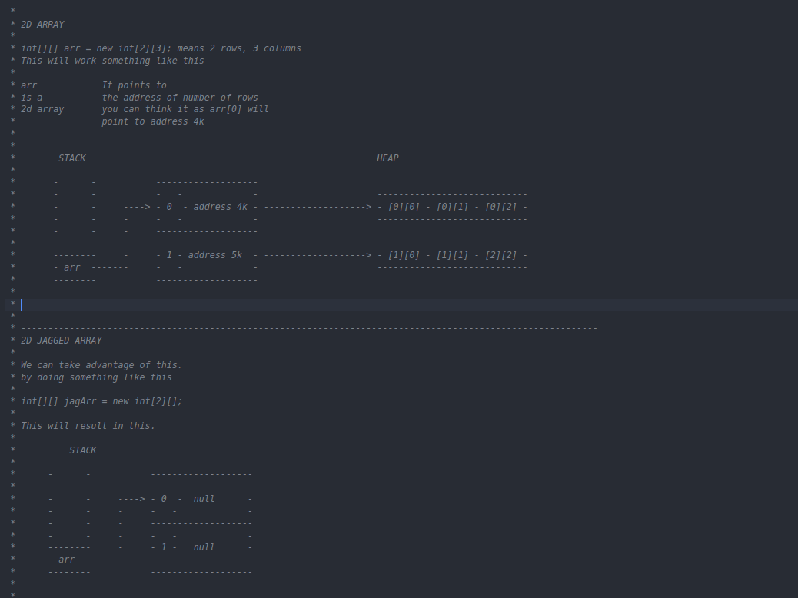

# Java-Transformation

This repository, aims to quickly build your proficiency in Java.
Follow it in this order and read the code.

- Architecture.md [here](./Architecture.md)
- Input.java [here](./input.java)
- datatype.java [here](./datatype.java)
- arrays.java [here](./arrays.java)
- array2d.java [here](./array2d.java)
- oops.java [here](./oops.java)
- arraylist.java [here](./arraylist.java)
- StringBuilderCRUD [here](./StringBuilderCRUD.java)
- More coming soon 

## Quick Glimpses
Some beautiful explanations, is snapped here.

